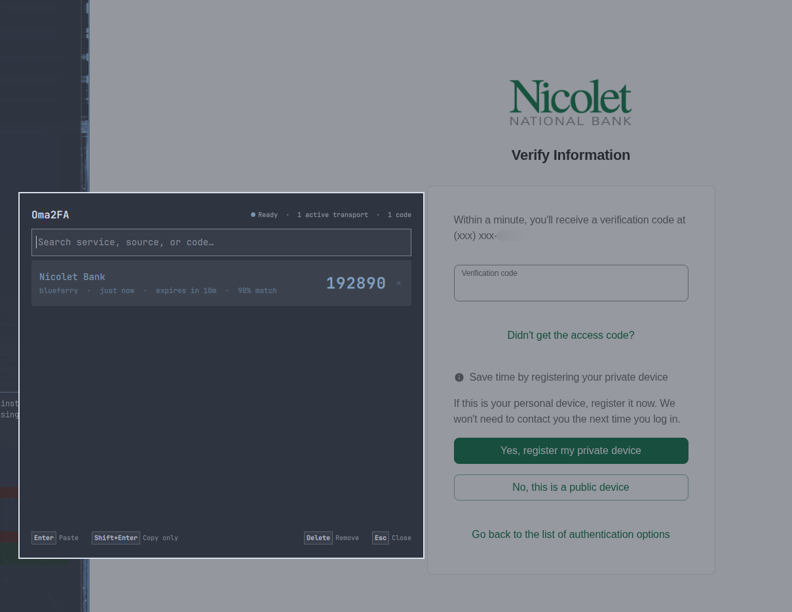
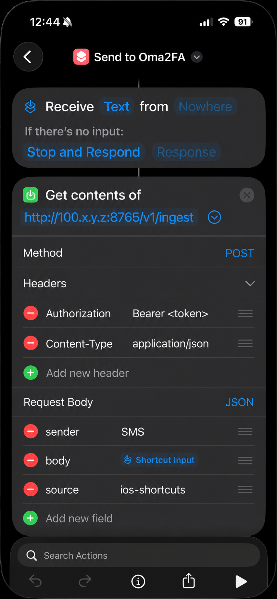
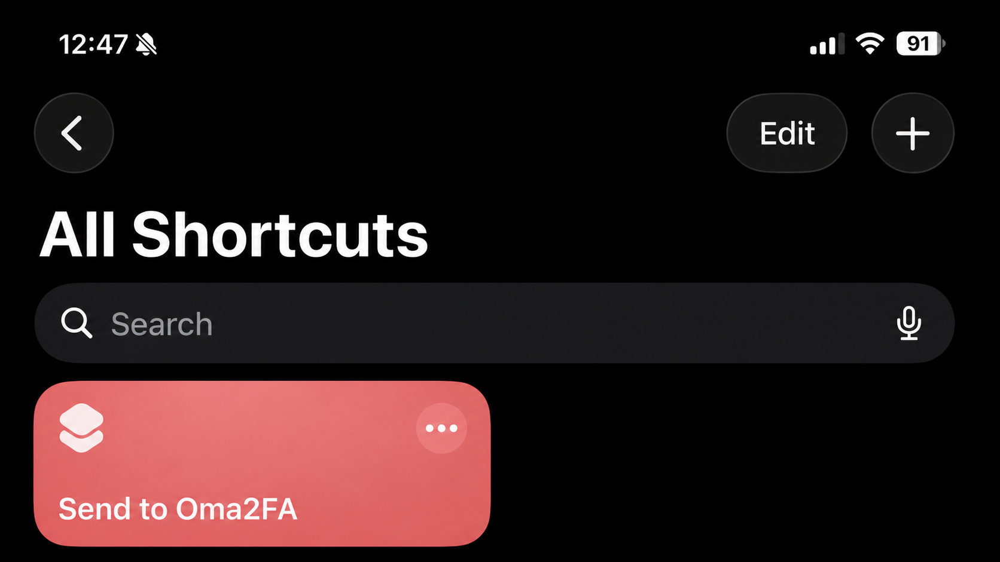
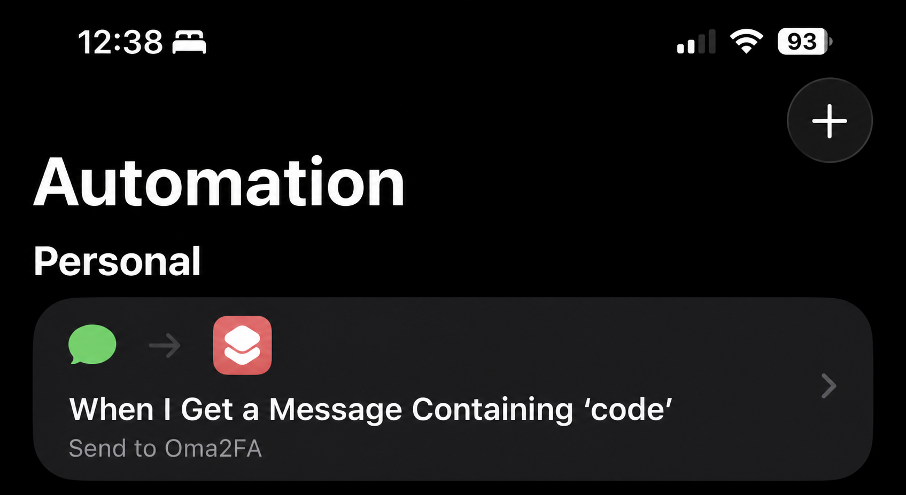

# Oma2FA

Oma2FA is a privacy-first Omarchy picker for short-lived verification codes.
It recognizes likely one-time codes in messages received locally, keeps only a
minimal expiring record, and copies or pastes a code only after you select it.

This is an alpha. The Omarchy picker, deterministic detector, runtime store,
BlueFerry adapter, and authenticated phone webhook are usable now. It is not a
replacement for passkeys, security keys, or authenticator apps; prefer those
when a service offers them.



## Quick start

This path installs Oma2FA from GitHub and uses an authenticated iPhone
Shortcut over Tailscale. BlueFerry users can install the plugin the same way
and then skip to [BlueFerry for iPhone](#blueferry-for-iphone-available-now).

### 1. Install the plugin

You need a current Omarchy installation and Python 3.12 or newer. In a
terminal, run:

```bash
omarchy plugin add https://github.com/jondkinney/oma2fa.git --enable
```

The plugin appears in the right side of the Omarchy bar. This Git-managed
installation does not add a keyboard shortcut or start a network listener.
Click the Oma2FA bar icon to open it. If the icon does not appear, run:

```bash
omarchy-shell shell rescanPlugins
omarchy plugin list
```

### 2. Connect the computer and phone with Tailscale

Install Tailscale on both devices, sign in to the same tailnet, and verify that
both appear online. The computer must have a working `tailscale` command and
`tailscale ip -4` must print its `100.x.y.z` address. See the official
[Tailscale quickstart](https://tailscale.com/kb/1017/install/) if either device
is not connected.

Oma2FA deliberately does not expose its HTTP listener over ordinary Wi-Fi,
Ethernet, port forwarding, or the public internet. The setup button is enabled
only when it detects an active Tailscale IPv4 address.

### 3. Let Oma2FA configure the computer

1. Open Oma2FA from the bar.
2. Click the transport summary in the upper-right corner.
3. Choose **Manage phone webhook…**.
4. Choose **Set up securely with Tailscale**.
5. Wait for the status to read **Ready**.

That one action creates a private bearer token, writes the webhook environment
file, installs the hardened `oma2fa-webhook.service` user unit, reloads the
user service manager, and enables and starts the listener. It does not need
`sudo`. The manager can later copy the connection values, disable or re-enable
the service, and rotate its token. Its built-in iPhone walkthrough provides a
separate **Copy** action for each value that must be typed or pasted. Token
rotation requires confirmation and the phone must be updated afterward.

After the webhook becomes ready, Oma2FA opens the **iPhone setup guide**
automatically. You can also open it directly from the picker's empty state with
**Open iPhone setup guide**, or from the connection screen with
**Open iPhone setup guide →**.

### 4. Create the iPhone Shortcut and automation

Apple's [Message automation](https://support.apple.com/guide/shortcuts/apdd711f9dff/ios)
can filter by sender or text, and Message automations can
[run without asking](https://support.apple.com/guide/shortcuts/apd602971e63/ios).
Names can vary slightly between iOS releases. Keep Oma2FA's **Phone webhook**
screen open while you build this: the walkthrough there shows these same
screens and gives every value that must be typed or pasted its own **Copy**
button. iOS menu choices remain visible as instructions without unnecessary
Copy actions. Copy a field on the computer, then send it to the phone with
LocalSend, KDE Connect, or another local transfer tool.

#### 4a. Build `Send to Oma2FA`

1. In **Shortcuts → Library**, tap **+** and name the new shortcut
   `Send to Oma2FA`.
2. Configure its input block as **Receive Text from Nowhere**. For no input,
   choose **Stop and Respond**.
3. Add **Get Contents of URL**. Paste the value from the walkthrough's **URL**
   row directly into that action, expand its options, and select **POST**.
   Apple documents the action in its
   [Shortcuts API guide](https://support.apple.com/guide/shortcuts/apd58d46713f/ios).
4. Add these headers. The **Header 1 · value** Copy button supplies the complete
   `Bearer <generated token>` value, so there is no prefix to assemble by hand:

   | Header | Value |
   | --- | --- |
   | `Authorization` | `Bearer <generated token>` from **Header 1 · value** |
   | `Content-Type` | `application/json` |

5. Set the request body type to **JSON** and add exactly:

   | Key | Value |
   | --- | --- |
   | `sender` | Fixed text `SMS` |
   | `body` | The blue **Shortcut Input** magic variable—not the literal words |
   | `source` | The fixed text `ios-shortcuts` |

   `sender` and `body` are required. After creating the `body` row, tap its
   value and insert the blue **Shortcut Input** variable. That row is
   intentionally not copyable because **Shortcut Input** must be selected as a
   magic variable rather than pasted as plain text. `timestamp` and
   `message_id` are optional; omit them unless the automation has trustworthy
   values.
The complete action should look like the screenshot below. Its address and
credential are deliberately replaced with placeholders; use the values copied
from your own Oma2FA installation.

<p align="center">
  
</p>

6. Save the shortcut. Its Library card should look like this:

<p align="center">
  
</p>

#### 4b. Attach it to incoming Messages

1. Open **Shortcuts → Automation**, tap **+**, and add a personal automation
   using the **Message** trigger.
2. Set **Message Contains** to `code`. Add a **Sender** filter only if you know
   every sender that delivers your codes. You can create additional automations
   for phrases such as `verification` or `one-time` if needed.
3. Select **Run Immediately** (or disable **Ask Before Running**, depending on
   the iOS version), continue, and choose **Send to Oma2FA**.
4. Save the automation and confirm that Tailscale remains connected on the
   phone. The Automation tab should look like this:

<p align="center">
  
</p>

All copied setup values use a sensitive desktop clipboard offer that expires
after about 60 seconds, so copy a row again if necessary. The raw-token button
is retained for troubleshooting, but normal setup should use the complete
**Header 1 · value** row.

### 5. Verify receipt

Trigger the automation with a test message containing an obvious phrase such
as `Your verification code is 123456`. A generic desktop notification should
appear, the bar icon should show a badge, and the code should appear in the
picker. The notification intentionally contains no sender, service, message,
or code.

On the computer, these commands confirm the listener without printing its
token:

```bash
systemctl --user status oma2fa-webhook.service
journalctl --user -u oma2fa-webhook.service --since today
```

## How it works

```text
BlueFerry (Bluetooth MAP) ─┐
Phone webhook (VPN) ───────┼─> local detector ─> short-lived runtime store
Manual/test ingestion ─────┘                         │
                                                     ▼
                                  Omarchy service + bar icon + picker
                                                     │
                                      chosen code only: clipboard
                                                     │
                                verified prior window: optional paste
```

The Omarchy shell keeps `Service.qml` loaded and starts
`bin/oma2fa-bridge`. The bridge speaks JSON Lines over its private stdin and
stdout; it is not a network service. `Picker.qml` displays the minimal records
returned by that bridge. The UI/BlueFerry path needs no separate systemd unit,
which avoids two bridge processes competing for the same transport. An
independent user unit, provisioned by the setup UI, runs only the standalone
phone webhook so messages can arrive while the picker is closed.

Code detection is deterministic and local. It scores 4–8 digit and supported
alphanumeric candidates against phrases such as “verification code” and
“one-time password,” while rejecting common order numbers, phone numbers,
dates, prices, and URLs. It does not send message content to an LLM or remote
classifier.

## Transport status

### BlueFerry for iPhone: available now

[BlueFerry](https://github.com/erikwb/blueferry) connects a paired iPhone over
Bluetooth Message Access Profile (MAP). Oma2FA's current adapter consumes
BlueFerry's `/usr/bin/blueferry-quickshell-bridge` and `blueferry.client`
locally. A bounded Events1 receive query is the authoritative code path;
conversation history is an independent compatibility fallback. Both paths
immediately reduce matching messages to a code, service label, source,
timestamps, and confidence. Full SMS bodies are not written to Oma2FA's store.

The adapter has been exercised end to end against pristine BlueFerry `v0.7.7`
and upstream commit `dee0b097`. Those releases omit receive-only short codes
from their conversation projection, but retain them in Events1, where Oma2FA
detects them. Local BlueFerry changes that display short codes in BlueFerry's
own UI are useful but are not required by Oma2FA. If Events1 is unavailable,
Oma2FA reports the transport as degraded instead of claiming it is ready.

BlueFerry is the practical local iPhone experiment today, but it is still
experimental. Pair and verify your phone in BlueFerry before troubleshooting
Oma2FA. Granting MAP access allows the paired computer to read messages, not
just verification codes, while the connection is active.

### iPhone

Apple does not provide Messages for Linux, an iCloud Messages web client, or a
public SMS inbox API. [Apple's Text Message Forwarding support](https://support.apple.com/en-us/102545)
targets Apple devices, so entering iCloud credentials into an unofficial Linux
client is deliberately out of scope.

The authenticated, disabled-by-default webhook is the network alternative for
iOS Shortcuts: the phone can filter a received-message automation and send
only a candidate to the computer. See the CLI help and webhook section below
for the listening address, token, and payload contract.

### Android

Direct KDE Connect SMS ingestion is planned but is not implemented in this
release. [KDE Connect](https://kdeconnect.kde.org/) is preferable to scraping
Google Messages for Web or depending on notification text: Android 15
[protects some OTPs from notification listeners](https://developer.android.com/about/versions/15/behavior-changes-all),
and Android 17 [may delay OTP delivery to ordinary SMS apps](https://developer.android.com/about/versions/17/behavior-changes-all).
For the MVP, a trusted on-device automation can call the same authenticated
webhook as iOS. A future Android companion could offer the strongest privacy
mode by extracting the code on the phone and sending only the derived record.

### Authenticated phone webhook

The recommended setup is available in the picker: open the transport summary,
choose **Manage phone webhook…**, then choose **Set up securely with
Tailscale**. Oma2FA detects the computer's active Tailscale IPv4 address,
creates a random bearer token, installs and starts the hardened user service,
and then offers a field-by-field iPhone walkthrough with privacy-safe reference
screenshots. Every value that must be typed or pasted is individually copyable,
including the full `Bearer <token>` header value; iOS menu choices and magic
variables are shown without Copy buttons. The token itself never enters QML.
The manager can also enable or disable the listener and rotate its token.
Rotation requires a second confirmation because the phone must be updated
afterward.

The setup UI deliberately supports only the direct Tailscale path. Connect the
computer and phone to the same Tailscale network before opening it. Advanced
loopback/HTTPS-proxy and other WireGuard configurations remain manual so the UI
cannot accidentally assert that an arbitrary network interface is encrypted.

The webhook inside the UI bridge is disabled unless
`OMA2FA_WEBHOOK_ENABLED=1` is set or the bridge is started with `--webhook`.
The standalone `oma2fa webhook` command enables only the listener. Its defaults
are `127.0.0.1:8765`; a phone cannot reach that loopback address. The built-in
server is HTTP and rejects non-loopback and wildcard binds unless you explicitly
declare an exact VPN address. Never expose it directly over ordinary Ethernet,
Wi-Fi, port forwarding, or the public internet: both the reusable bearer token
and the message body would be visible to network observers.

There are two supported remote-access patterns:

- Bind to the computer's exact Tailscale/WireGuard address and set
  `OMA2FA_WEBHOOK_TRANSPORT=vpn`. Encryption is then supplied by the VPN.
- Keep Oma2FA on `127.0.0.1` and put an HTTPS reverse proxy on the same computer
  in front of it. The phone must use the proxy's `https://` URL.

The `vpn` setting is an explicit security assertion, not VPN detection. Set it
only when the bind address belongs exclusively to an active encrypted tunnel.

Configuration is file/environment-based so the secret never appears in process
arguments or QML state. The setup UI manages these files:

- `$XDG_CONFIG_HOME/oma2fa/webhook.env` (normally
  `~/.config/oma2fa/webhook.env`) contains only the bind, port, transport, and
  absolute token-file path.
- `$XDG_CONFIG_HOME/oma2fa/webhook-token` is the mode-`0600` bearer-token file.
- `$XDG_CONFIG_HOME/systemd/user/oma2fa-webhook.service` is the hardened user
  unit copied from the plugin.

The underlying variables are:

| Variable | Meaning |
| --- | --- |
| `OMA2FA_WEBHOOK_ENABLED` | Set to `1` to enable the listener in bridge mode. |
| `OMA2FA_WEBHOOK_BIND` | Listen address; defaults to `127.0.0.1`. |
| `OMA2FA_WEBHOOK_PORT` | Listen port; defaults to `8765`. |
| `OMA2FA_WEBHOOK_TRANSPORT` | Must be `vpn` for a non-loopback bind; omit for loopback/TLS-proxy mode. |
| `OMA2FA_WEBHOOK_TOKEN_FILE` | Preferred path to a mode-`0600` bearer-token file. |
| `OMA2FA_WEBHOOK_TOKEN` | Direct token fallback; avoid persistent environment files containing it. |

Generate a token without printing it:

```bash
install -d -m 0700 ~/.config/oma2fa
(umask 077; openssl rand -hex 32 > ~/.config/oma2fa/webhook-token)
```

For an interactive foreground listener on the loopback default:

```bash
OMA2FA_WEBHOOK_TOKEN_FILE="$HOME/.config/oma2fa/webhook-token" \
  ./bin/oma2fa webhook
```

The only accepted endpoint is `POST /v1/ingest`, with
`Authorization: Bearer <token>` and `Content-Type: application/json`:

```json
{
  "sender": "Example",
  "body": "Your verification code is 123456",
  "source": "ios-shortcuts",
  "timestamp": "2026-08-21T12:00:00Z",
  "message_id": "phone-generated-stable-id"
}
```

`sender` and `body` are required; `source`, `timestamp`, and `message_id` are
optional. Omit `timestamp` unless the automation supplies the message's actual
receive time. Requests are capped at 16 KiB, unauthenticated requests and
other methods/paths are rejected, and request bodies are not logged. Records
appear as `webhook/<source>` in the picker.

For advanced manual setup, the repository includes the same hardened user unit
installed by the UI. It runs the standalone webhook process, not another UI
bridge. First create `~/.config/oma2fa/webhook.env` with an absolute token path
and your chosen bind address:

```ini
OMA2FA_WEBHOOK_BIND=127.0.0.1
OMA2FA_WEBHOOK_PORT=8765
OMA2FA_WEBHOOK_TOKEN_FILE=/home/your-user/.config/oma2fa/webhook-token
```

Keep that file private (`chmod 0600 ~/.config/oma2fa/webhook.env`). In an iOS
Shortcut or trusted Android automation, configure a JSON `POST` to either
`http://<vpn-address>:8765/v1/ingest` over the VPN or the reverse proxy's
`https://<hostname>/v1/ingest` URL. Add the bearer token as the `Authorization`
header. Prefer extracting or pre-filtering on the phone when the automation
system permits it.

For direct VPN access, use an exact address rather than `0.0.0.0`, `::`, or a
hostname:

```ini
OMA2FA_WEBHOOK_BIND=100.64.0.10
OMA2FA_WEBHOOK_TRANSPORT=vpn
OMA2FA_WEBHOOK_PORT=8765
OMA2FA_WEBHOOK_TOKEN_FILE=/home/your-user/.config/oma2fa/webhook-token
```

Then install and enable the unit explicitly:

```bash
install -Dm0644 systemd/oma2fa-webhook.service \
  ~/.config/systemd/user/oma2fa-webhook.service
systemctl --user daemon-reload
systemctl --user enable --now oma2fa-webhook.service
```

Check it with `systemctl --user status oma2fa-webhook.service`. The UI bridge
and standalone webhook share the owner-only runtime store; the picker refreshes
that store whenever it opens. The standalone listener also publishes a minimal
owner-only heartbeat so the picker can report it as an active transport. That
heartbeat contains only a format version, timestamp, and random process-instance
identifier; it contains no bind address, token, sender, message body, or code.
Hover the transport count in the picker to preview each transport's derived
health, or click it to keep the details open and enter the webhook manager.
Arbitrary backend detail is never rendered in that disclosure. Token-copying
happens entirely in the Python backend through an expiring sensitive clipboard
offer; the token is never returned across the bridge.

## Requirements

- A current Omarchy installation with `omarchy plugin` commands.
- Python 3.12 or newer.
- `jq`, `hyprctl`, `wl-copy`, `wtype`, and coreutils `timeout` (normally
  supplied by Omarchy).
- Tailscale on the computer and phone when using the guided phone-webhook
  setup. The computer's `tailscale ip -4` command must report an active address.
- BlueFerry `v0.7.7` or newer and a paired iPhone for automatic local SMS
  ingestion. The backend package must provide both
  `/usr/bin/blueferry-quickshell-bridge` and the `blueferry.client` Python
  module. Alternatively, use a trusted phone automation with the authenticated
  webhook.

The Python core uses the standard library. You do not need a virtual
environment for the copied plugin.

## Install

Review the source first: Omarchy plugins execute unsandboxed inside the
long-running shell process.

### Marketplace/Git installation

Install and enable the public repository with Omarchy's native lifecycle:

```bash
omarchy plugin add https://github.com/jondkinney/oma2fa.git --enable
```

This creates a Git-managed checkout at
`~/.config/omarchy/plugins/io.github.jondkinney.oma2fa` and enables the bar
widget. It does not modify Hyprland keybindings; click the bar icon or use the
manual toggle command below. Omarchy manages updates and removal for this path.

### Development checkout with optional hotkey

From a reviewed development checkout, run:

```bash
./scripts/install.sh
```

For non-interactive use:

```bash
./scripts/install.sh --yes
```

The installer:

1. stages a copy under `~/.config/omarchy/plugins/`;
2. refuses symlinks and validates the staged plugin with
   `omarchy plugin validate`;
3. atomically installs it as `io.github.jondkinney.oma2fa`, enables it with the
   official Omarchy command, and places its widget in the right bar section; and
4. checks the live keybinding list before adding a clearly marked
   `SUPER+ALT+V` block to `~/.config/hypr/bindings.lua`.

Existing bindings are never overridden. If `SUPER+ALT+V` is occupied, the
plugin is still installed and the installer prints the manual open command.
Every binding edit is backed up, reloaded, and checked with
`hyprctl configerrors`. Symlink-managed binding files are deliberately not
edited; use `--no-bind` and add the shown binding to the symlink target yourself.

The install is a real copy, not a symlink, because Omarchy's plugin validator
rejects symlinks. Re-run the installer after changing a development checkout;
it preserves the previous managed copy in a hidden, timestamped backup.
Reinstalling leaves an existing widget wherever you moved it. Upgrading from
the original hotkey-only release performs a one-time migration from its old
service entry to the new bar entry.

## Use

Click the Oma2FA bar icon or press `Super+Alt+V`. The badge is only a count of
available codes; the bar never displays a code or message content. Search is
active when the picker opens, while the newest matching code remains the
default Enter action. When a new code is accepted, Oma2FA also shows a generic
desktop notification; it contains no code, sender, service, or message text.

- Type to filter by service, source, or code.
- Press Down to enter the results at the newest code, or Up to enter at the
  oldest; then use Up/Down, Page Up/Page Down, Home, or End to browse. Pressing
  Up from the newest result returns to the search input.
- Press Enter to copy and request a paste into the window that was focused
  before the picker opened.
- Press Shift+Enter to copy only.
- Press Delete to remove the selected record.
- Press Escape to close without touching the clipboard.

A successful copy consumes that record so it cannot be selected twice. The
sensitive clipboard offer expires after about 60 seconds.

The paste path captures the active Hyprland window before opening the overlay.
After selection, it closes the overlay and verifies that the same window is
active before typing. If focus cannot be verified, it fails closed: the code
remains on the clipboard, but Oma2FA does not type it.

You can always open the picker without a keybinding:

```bash
omarchy-shell shell toggle io.github.jondkinney.oma2fa '{}'
```

## Update

Git-managed installations can be updated with:

```bash
omarchy plugin update io.github.jondkinney.oma2fa --yes
```

The Omarchy shell reloads the plugin code. If the standalone phone webhook is
configured, restart that long-running process so it uses the updated Python
code:

```bash
systemctl --user restart oma2fa-webhook.service
```

## CLI and manual ingestion

The checkout-local launcher resolves its own directory, so it works from any
current working directory:

```bash
./bin/oma2fa --help
./bin/oma2fa status
./bin/oma2fa list
printf '%s\n' 'Example verification code is 123456' | \
  ./bin/oma2fa ingest --sender Example --source manual --message-id docs-example-1
```

`ingest` deliberately accepts the body only on stdin, keeping a real OTP out of
shell history and process arguments. It also accepts `--timestamp` as ISO time
or epoch seconds. Global `--runtime-dir PATH`, when needed for an isolated
test, must appear before the subcommand. The CLI's help remains the
authoritative source for flags while the project is alpha.

The UI-facing `bin/oma2fa-bridge` is not intended for interactive use. Its
normal channel contains derived records and allowlisted webhook status, not
original BlueFerry message bodies or the webhook bearer token. Token-copy
requests are completed inside the backend and return only success or failure.

## Security and privacy model

- Processing happens under your Linux user account and does not call a cloud
  classification service.
- Original message bodies are processed in memory and discarded. The runtime
  store contains derived records only.
- Records live below `$XDG_RUNTIME_DIR/oma2fa` (or a per-user runtime fallback),
  with mode-`0700` directory and mode-`0600` files. Codes expire after ten
  minutes by default.
- A code enters the clipboard only after explicit selection. Oma2FA uses the
  Wayland sensitive-data hint and limits clipboard lifetime where supported.
- Automatic paste is conditional on matching the window captured before the
  picker opened. Copy-only remains available when that check is unavailable.
- Codes and message bodies must never be written to application logs,
  notifications, command-line arguments, or analytics. New-code notifications
  are intentionally generic.

These controls reduce exposure; they cannot make the desktop clipboard a
secret enclave. Other processes running as your user may be able to observe
clipboard contents or inspect process memory. BlueFerry/MAP also grants the
computer broader message access before Oma2FA performs its filtering.

## Troubleshooting

### The Tailscale setup button is disabled

Confirm the Linux client is installed, authenticated, and online:

```bash
tailscale status
tailscale ip -4
```

The second command must print a `100.x.y.z` address. Also confirm the phone is
online in the same tailnet. Tailscale's
[device-connectivity guide](https://tailscale.com/kb/1452/connect-to-devices/)
covers ACL and reachability problems.

### The picker says the webhook is disabled or not responding

Open **Manage phone webhook…** and use **Enable webhook**, then inspect the
unit if it does not become ready:

```bash
systemctl --user status oma2fa-webhook.service
journalctl --user -u oma2fa-webhook.service -n 100 --no-pager
```

The service runs as the current user. Its configuration is normally at
`~/.config/oma2fa/webhook.env`; its token is in the separate owner-only
`~/.config/oma2fa/webhook-token` file. Do not paste either file into an issue.

### The Shortcut reports unauthorized

Use **Header 1 · value → Copy** in the walkthrough again and ensure the header
is exactly `Authorization: Bearer <token>`, including the space after `Bearer`.
If the token was rotated, every phone automation using the old value must be
updated.

### The service is ready but no code appears

- Verify the Shortcut ran and that its Message trigger filters match.
- Confirm `body` receives the incoming message rather than a literal label.
- Use a clear test phrase with a 4–8 character candidate, such as
  `Your verification code is 123456`.
- Check that the phone's Tailscale connection is active when the message
  arrives.
- Remember that duplicates are intentionally ignored and codes expire after
  ten minutes.

### BlueFerry is disconnected or degraded

Pair the iPhone in BlueFerry first and verify BlueFerry can receive current
messages. Oma2FA requires both `/usr/bin/blueferry-quickshell-bridge` and the
`blueferry.client` Python module. A degraded state means the receive-event path
is unavailable, even if conversation history can still be read.

### The bar widget or notification does not appear

```bash
omarchy-shell shell rescanPlugins
omarchy plugin list
omarchy restart shell
```

The bar badge and desktop toast are intentionally generic; open the picker to
see the derived record. If the plugin is enabled but absent from the bar, use
Omarchy's bar settings to place the Oma2FA widget in a visible section.

## Development and tests

Run the core tests and validate the Omarchy manifest from the repository root:

```bash
python -m unittest discover -s tests -v
omarchy plugin validate .
bash -n bin/oma2fa bin/oma2fa-bridge scripts/install.sh scripts/uninstall.sh \
  scripts/test-install.sh scripts/test-marketplace-install.sh \
  scripts/test-bar-widget.sh \
  scripts/test-qml-bar-widget.sh scripts/test-qml-picker-status.sh \
  scripts/test-qml-picker-shortcuts.sh
./scripts/test-bar-widget.sh
./scripts/test-qml-bar-widget.sh
./scripts/test-qml-picker-status.sh
./scripts/test-qml-picker-shortcuts.sh
./scripts/test-install.sh
./scripts/test-marketplace-install.sh
```

Optional static checks configured by `pyproject.toml`:

```bash
ruff check .
mypy oma2fa
```

To use a different interpreter without installing the package, set
`OMA2FA_PYTHON` to one executable path:

```bash
OMA2FA_PYTHON=/path/to/python ./bin/oma2fa --help
```

## Uninstall

If you installed the optional webhook unit, stop and remove it first:

```bash
systemctl --user disable --now oma2fa-webhook.service
rm ~/.config/systemd/user/oma2fa-webhook.service
systemctl --user daemon-reload
```

The private environment and token files are intentionally preserved so an
accidental plugin removal does not silently destroy credentials. After the
service is stopped, remove them too if you want a complete cleanup:

```bash
rm ~/.config/oma2fa/webhook.env ~/.config/oma2fa/webhook-token
rmdir ~/.config/oma2fa 2>/dev/null || true
```

For a marketplace/Git installation, use Omarchy's native removal command:

```bash
omarchy plugin remove io.github.jondkinney.oma2fa --yes
```

For a copy installed by `scripts/install.sh`, use its matching uninstaller:

```bash
./scripts/uninstall.sh
```

Use `--yes` for non-interactive confirmation. `--keep-plugin` or
`--keep-binding` can preserve one part. The uninstaller removes only the exact
binding marker block and a plugin directory carrying Oma2FA's installer
ownership marker. It refuses an unmarked directory at the same path. Omarchy's
official removal command deletes a Git-managed checkout. For a non-Git copy,
the custom uninstaller preserves the plugin as a hidden backup, and the
Hyprland binding file receives its own timestamped backup.

## License

[MIT](LICENSE)
